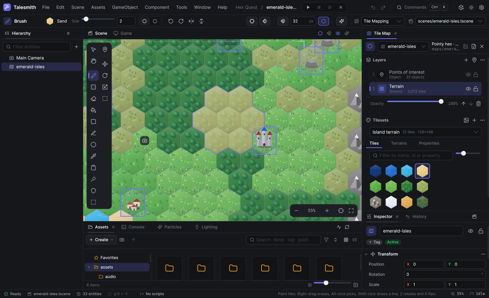

# Talesmith

Talesmith is a 2D game engine and editor for .NET 10. You build scenes from tile maps, sprites, lights, particles and prefabs, write
gameplay in C#, play the game inside the editor and export it for Windows or Linux. Maps are hexagonal or rectangular and use the `.hexy`
format of the Hexy map editor.



## Install

Each [release](https://github.com/CodeByDylan/Talesmith/releases) has a Windows installer, a package for Debian and Ubuntu, an archive for
other Linux distributions and a Nix flake; [Installation](https://talesmith.dev/guide/getting-started/installation) explains each one. To
work on the engine itself, build it from source as below.

## Requirements

- The [.NET 10 SDK](https://dotnet.microsoft.com/download), version 10.0.400 or later (`global.json` pins it).
- Windows or Linux. A Vulkan driver is optional; without one, games and the editor render with Skia.
- Node.js 20 or later, only to work on the documentation site.

## Getting started

```bash
dotnet build Talesmith.slnx
dotnet run --project src/Talesmith.App
```

The project hub opens. Create a project from a template, or open one of the samples:

```bash
dotnet run --project src/Talesmith.App -- samples/LanternGrove
```

In the editor, **Ctrl+P** plays the open scene and stops it again, **Ctrl+K** searches every command, and **F1** lists the shortcuts.
**File › Build settings** exports a standalone game.

Games also run without the editor:

```bash
dotnet run --project src/Talesmith.Player -- samples/IsleHopper
```

While a game runs, **F3** shows the performance overlay, **F4** cycles the debug views, **F9** saves a profiler report and **F12** saves a
screenshot, all to `./captures`.

## Samples

| Sample | What it shows |
| --- | --- |
| [Lantern Grove](samples/LanternGrove/README.md) | A platformer made only of editor content: a map, a scene, a prefab, particle presets, sounds and C# scripts |
| Isle Hopper | A platformer on a rectangular map with a parallax backdrop, written as a plugin |
| Hex Quest | A hex adventure written as two plugins, one for gameplay and one for cutscenes and dialogue |

Building the solution also builds the sample plugins and Lantern Grove's scripts into each game folder, so all three run straight away.

## Documentation

The full guide is at [talesmith.dev](https://talesmith.dev): using the editor, C# scripting, writing plugins, performance, the
architecture, every file format, and building and testing this repository. Its sources are in [`website/`](website/README.md); to
read it locally:

```bash
cd website
npm install
npm start
```

## Contributing

Contributions are welcome. [CONTRIBUTING.md](CONTRIBUTING.md) explains how to propose a change, and [SECURITY.md](SECURITY.md) how to
report a vulnerability privately.

## License

Talesmith is licensed under the [Apache License 2.0](LICENSE); see also [NOTICE](NOTICE). You may use it for any purpose, including
making and selling games. The libraries it uses keep their own licenses: [THIRD-PARTY-NOTICES.md](THIRD-PARTY-NOTICES.md) lists them, and
every exported game carries them in its `licenses` folder, which you ship with the game.

The license does not cover the Talesmith name or logo, so a fork needs a name of its own.
