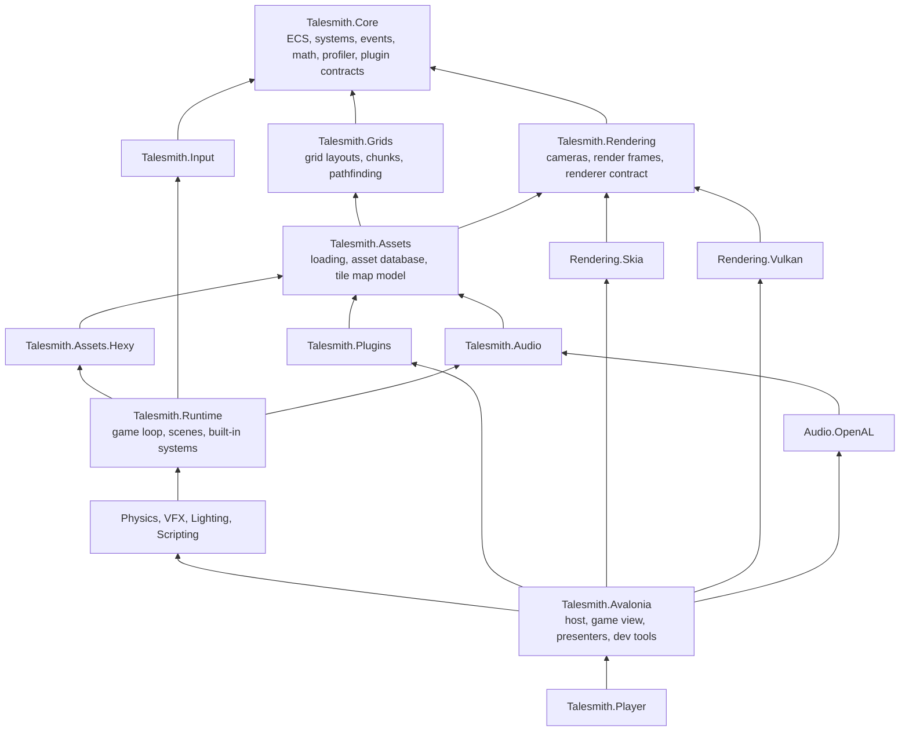
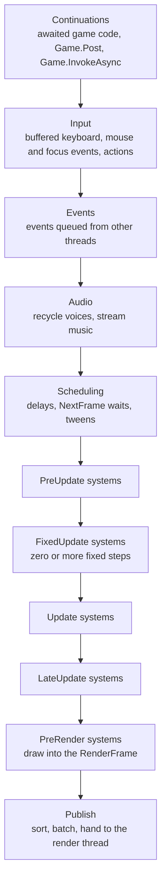
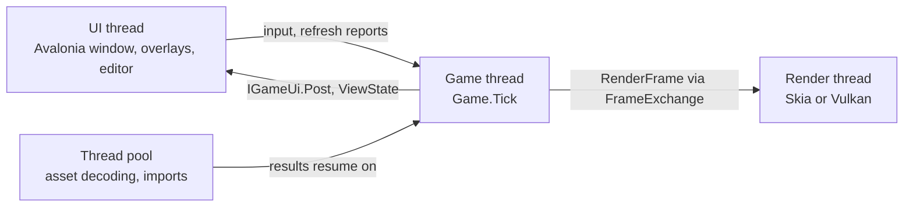

The runtime is a set of small libraries, each depending only on the layers below it, with games and features added as plugins on top. This page explains how a game is built from its services, what happens in one frame, which threads run what and how they talk, and how the ECS, events, scenes, assets and presentation work. For the editor on top of all this, see [Editor architecture](./editor-architecture.mdx).

## Layers



Arrows point from a project to what it references; references to layers further down are left out. The contracts a plugin compiles against (`Core`, `Grids`, `Input`, `Assets`, `Rendering`, `Audio`, `Runtime` and the engine modules) never reference a backend. The backends (`Rendering.Skia`, `Rendering.Vulkan`, `Audio.OpenAL`) and the host (`Talesmith.Avalonia`) are chosen when a game starts. [Repository layout](./project-layout.mdx) lists every project and the rules for adding to them.

## The game and its services

A game is a `Game` object built by `GameBuilder` from an asset folder. Everything is wired with `Microsoft.Extensions.DependencyInjection`:

<Steps>

1. The host creates a `GameBuilder`, registers its renderer, audio backend and logging, and loads plugins, which add their own services, systems, scenes and overlays.
2. `GameBuilder.Build` adds engine defaults for anything not registered yet and creates the `Game`. Because defaults only fill gaps, a plugin can replace any engine service.
3. Each scene gets its own service scope with its own `World` and its own system instances, so nothing leaks from one scene into the next.

</Steps>

Singletons such as `IInputService`, `IEventBus`, `IAudioService`, `IAssetManager`, `IGameScheduler` and `ITweenService` live as long as the game. Systems are created per scene and receive these through their constructors. Services registered with `AddScoped` get a fresh instance per scene.

In practice hosts do not use `GameBuilder` directly. `GameSession.Create` in `Talesmith.Avalonia` picks the renderer and audio backend, loads plugins and calls the module registrations (`AddTalesmithPhysics`, `AddTalesmithParticles`, `AddTalesmithLighting`, `AddTalesmithScripting`), so the player, the editor's viewport and play mode all get the same engine.

## A frame

`Game.Tick` runs one frame on the game thread. Every step and every system is a profiler marker, so the [performance overlay and reports](/guide/performance) show exactly where the time goes.



| Step | What happens |
| --- | --- |
| Continuations | Work awaited by game code resumes, and work other threads sent with `Game.Post` and `Game.InvokeAsync` runs. |
| Input | Keyboard, mouse and focus events buffered since the last frame, from any thread, are applied and actions update. |
| Events | Events queued with `IEventBus.Enqueue` from other threads are delivered. |
| Audio | Finished voices are recycled and music streams. |
| Scheduling | Delays, `NextFrame` waits and tweens advance. |
| `PreUpdate` | Systems that react to the new frame, such as spawning. |
| `FixedUpdate` | Zero or more fixed steps (60 per second by default, at most `maxFixedStepsPerFrame`) for deterministic simulation such as physics. |
| `Update` | Gameplay. |
| `LateUpdate` | Work that follows gameplay, such as cameras. |
| `PreRender` | Systems draw into the frame's `RenderFrame`. |
| Publish | The frame is sorted, batched and handed to the render thread; `FramePublished` lets the host request a repaint. |

Game time can be scaled (`Game.TimeScale`) or paused (`Game.IsPaused`). Systems receive scaled and unscaled time in `GameTime`, and the steps after `FixedUpdate` receive an interpolation factor for drawing smoothly between fixed steps.

`ExecutionModes` decide which systems run: the editor's edit world runs in `Edit`, its particle and animation preview in `Preview`, and games in `Play`. A system declares its modes with `[ExecuteIn(...)]`; without it, `PreRender` systems run in every mode and all others only in `Play`.

## Threads



- **The game thread** runs `Game.Tick`. The host decides which thread that is with `GameThreading`:
  - `Dedicated`: a `SimulationThread`, a named thread of above-normal priority, runs the frames. The player and the editor's play mode use it. With VSync, a frame runs on every refresh the window's compositor reports: the `GameView` forwards Avalonia's animation frames, and a frame-rate cap skips refreshes as needed. When reports stop because the UI thread is busy, frames continue on the thread's own clock at the display's refresh rate; after a second without reports, such as while the window is hidden, they slow to 20 per second. Without VSync, frames run as fast as the frame-rate cap allows. `FrameSchedule` makes these decisions on the timestamps of any clock, so its tests run on simulated time.
  - `Host`: the host ticks the game on its own thread. The editor's edit world runs this way on the UI thread, because the editor changes it from the UI thread all the time. Headless runs, benchmarks and tests tick on the calling thread.
- **The UI thread** runs Avalonia: the window, overlays and the editor. It never waits for the game; it forwards input, reports refreshes and repaints. A stalled UI thread does not change gameplay timing.
- **The render thread** draws published frames. With Skia it is Avalonia's render thread; with Vulkan it is a dedicated thread that records and submits each frame.
- **Background work** such as asset decoding runs on the thread pool. `await` in game code always resumes on the game thread, at the start of the next frame.

`FrameExchange` connects the game and render threads with three rotating `RenderFrame`s: one being built, one ready and one being rendered. Neither side waits for the other, and when the game produces frames faster than they can be shown, the newest frame wins. The `RenderFrame` is the only game data the render thread reads, so it never sees half-updated state.

### Crossing threads

The world, systems, scenes and most services belong to the game thread. Other threads reach them through these:

| From | API | Behavior |
| --- | --- | --- |
| Any thread | `Game.Post(action)` | Runs at the start of the next frame, in order with other posts, before input is applied. Exceptions are logged. |
| Any thread | `Game.InvokeAsync(func)` | Runs on the game thread and returns its result: immediately when already on the game thread, otherwise at the start of the next frame. Exceptions fault the task; it is canceled when the game is disposed first. |
| Any thread | `IInputSink`, `Game.IsActive`, `Viewport`, `FramePacing` | Thread-safe; the next frame applies them. |
| The game thread | `IGameUi.Post(action)`, `ViewState<T>.Publish` | Hand state to the UI thread for overlays and menus. |

`Game.IsGameThread` tells whether code runs on the game thread, and `Game.VerifyAccess()` throws when a simulation thread runs the game and the caller is elsewhere. Debug builds check it when `IsPaused`, `TimeScale`, `Mode` and `CameraOverride` change, and `Tick` refuses to run while another thread runs a frame.

The game thread never waits for the UI thread, so stopping a simulation thread from the UI thread, with `SimulationThread.Stop` or by disposing the game, cannot deadlock. An exception that escapes a frame is logged and the next frame runs as usual.

## Entity component system

`World` stores entities in archetypes: all entities with the same set of components share one archetype, and each component type is a contiguous array inside it. A query walks these arrays in order.

- **Components** are plain structs, or classes for shared data. `World.Set`, `Get`, `Has` and `Remove` work on single entities; `Get` returns a reference you can modify in place.
- **Queries** are cached by their description and pick up new archetypes automatically. `ForEach` takes a delegate; `Run` takes a struct job, which the JIT inlines and which never allocates. Archetype spans are available for hand-written loops.
- **Structural changes** (creating or destroying entities, adding or removing components) are not allowed while a query iterates. Record them in the `CommandBuffer` from `SystemContext.Commands`; it plays back after each system.
- **Observers.** `World.Observer` is told about every structural change. Scene worlds publish them as `EntityCreated`, `EntityDestroyed`, `ComponentAdded` and `ComponentRemoved` events, skipping events nobody subscribed to. A world without an observer pays nothing, and reading or writing existing components never notifies.

```csharp
[UpdateIn(SystemPhase.Update)]
public sealed class SpinSystem : ISystem
{
    public void Update(in SystemContext context)
    {
        var job = new SpinJob(context.Time.DeltaTime);
        context.World.Query<Transform, Spin>().Run<SpinJob, Transform, Spin>(ref job);
    }

    private readonly struct SpinJob(float delta) : IForEach<Transform, Spin>
    {
        public void Execute(Entity entity, ref Transform transform, ref Spin spin) => transform.Rotation += spin.Speed * delta;
    }
}
```

### Systems

A system implements `ISystem` and is registered with `services.AddSystem<T>()`. Attributes control scheduling:

| Attribute | Effect |
| --- | --- |
| `[UpdateIn(SystemPhase.X)]` | The phase; `Update` when absent. |
| `[UpdateAfter(typeof(Other))]`, `[UpdateBefore(typeof(Other))]` | Order within a phase. |
| `[SystemOrder(n)]` | Breaks remaining ties; lower runs first. |
| `[ExecuteIn(ExecutionModes.X)]` | The modes the system runs in. |

Systems that also implement `ISystemLifecycle` are told when their scene starts and stops. A system that throws is logged, and after three consecutive failures it is disabled, so one faulty system cannot take the whole game down.

## Events

`IEventBus` delivers struct events by reference without boxing.

- `Publish` delivers immediately to subscribers in priority order. Events implementing `ICancellableEvent` can be canceled by a handler, and later handlers do not run.
- `Enqueue` is safe from any thread; queued events are delivered at the start of the next frame.
- `PublishAsync` also awaits asynchronous subscribers, for flows such as "save, then continue".

Built-in events include the input and scene events, `MapLoaded`, `TriggerEntered`, `TriggerExited`, the world events above and `PauseStateChanged`. Hosts publish `PlayModeEntered`, `PlayModeExited` and `RenderBackendChanged`, and `GameSession` sends `PluginLoaded` for each loaded plugin on the game's first frame and `PluginUnloaded` for each when it is disposed.

## Scenes

A scene is a class deriving from `Scene`, registered by name with `services.AddScene<T>("name")` and loaded with a `SceneRequest` that carries the name and string parameters. `ISceneManager.LoadAsync` loads the next scene in the background, fades it in with an optional `SceneTransition` and disposes the previous scene's scope.

The engine ships two scenes:

| Name | Class | Parameters |
| --- | --- | --- |
| `"scene"` | `DocumentScene` | `path` or `guid` of a `.tscene` document. `ISceneDocumentSource`s, such as `InMemorySceneDocuments`, can supply documents that are not saved, which the editor's play mode uses. |
| `"map"` | `MapScene` | `map` (an asset path, or several separated by semicolons, stacked back to front), `focus` (a map object to center on) and `zoom`. |

`startScene` in `game.json` can name a `.tscene` file directly; it runs in `"scene"`. Code that is not a system but should run while a scene is active, such as music or trigger handling, implements `ISceneListener` and is registered with `services.AddSceneListener<T>()`. The document format is in [Scenes and prefabs](./file-formats/scenes-and-prefabs.mdx).

## Assets

`IAssetManager` loads assets by path relative to the asset root, or by guid. Importers are chosen by file extension, run on the thread pool, and each path is imported once per asset type and shared. Assets are reference counted: every load adds a reference and `Release` removes one. `ReloadAsync` imports an asset again while the game runs and queues an `AssetReloaded` event, delivered on the game thread at the start of the next frame.

Guids come from the `.meta` file next to each asset (see [Meta files](./file-formats/meta-files.mdx)), or from `assets.index.json` in an exported game, so shipped games need no `.meta` files. The editor and the build use `AssetDatabase` on top: scanning, `.meta` repair, content hashes, the dependency graph and file watching.

## Presentation

The Avalonia host shows a game in a `GameView` control. Its presenter decides how frames reach the screen:

- **Skia** renders straight onto Avalonia's canvas through a custom draw operation, so the game is composited with the UI using Avalonia's own GPU context.
- **Vulkan** renders on its own thread into images shared with Avalonia's compositor, so frames reach the window without passing through the CPU. Three images rotate and GPU semaphores order the handover, so neither the render thread nor the UI thread waits for the GPU.

On Linux the host asks Avalonia to composite with Vulkan, which can import shared images in any form the driver produces. The path is chosen when the game starts:

| Situation | Result |
| --- | --- |
| Vulkan available and the compositor can import its images | Vulkan, sharing images with the compositor |
| The compositor draws on the GPU but cannot import Vulkan images (OpenGL compositing with some drivers, or Windows) | Skia, drawing directly on the compositor's GPU context |
| The compositor works in software | Vulkan, reading each frame back and showing it as a bitmap |
| No Vulkan device | Skia |

The log states the choice and the reason. If sharing fails while the game runs, the presenter logs why, switches to reading frames back and queues a `RenderBackendChanged` event. The player's `--opengl-compositor` option makes Avalonia composite with OpenGL instead, for drivers that misbehave with its Vulkan compositor.

Overlays are Avalonia controls contributed by plugins through `IGameOverlay` and stacked above the game view, so game menus and HUDs are ordinary Avalonia UI.

## Related

- [Editor architecture](./editor-architecture.mdx)
- [Repository layout and layering](./project-layout.mdx)
- [Performance](/guide/performance): what each profiler marker measures
