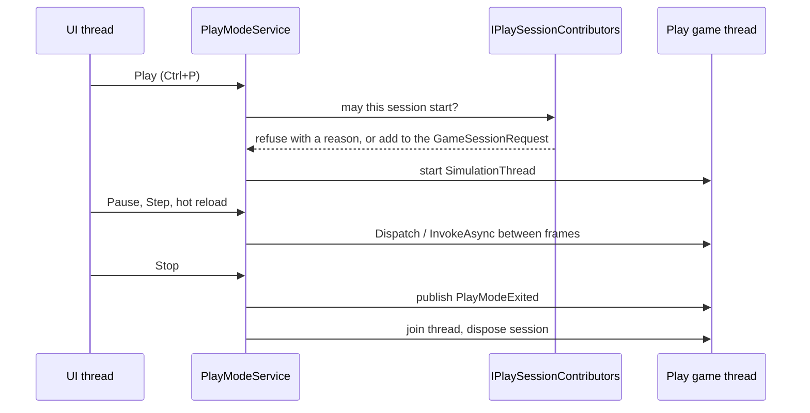

The editor is an Avalonia application built on the same engine games use. Each open project gets its own service provider, the scene you edit runs in a live game on the UI thread, play mode runs a second game on its own thread, and every built-in feature registers itself through the same extension points a plugin uses. This page explains those pieces and where their code lives.

## Projects

These projects make up the editor and its tooling, and no project a game ships references any of them:

| Project | Contents |
| --- | --- |
| `Talesmith.App` | The `talesmith` executable: startup, the composition root and the command line. |
| `Talesmith.Editor` | The shell, panels, viewport, tools, inspectors, play mode and the build UI. |
| `Talesmith.UI` | The themeable Avalonia toolkit: palettes, icons, docking, dialogs and editor controls. See [The editor UI toolkit](./ui-toolkit.mdx). |
| `Talesmith.Build` | Exporting standalone games, usable without the editor. |
| `Talesmith.Scripting.Compiler` | Roslyn compilation, diagnostics and hot reload, for the editor and builds only. |

Shipped games contain no Roslyn, no editor code and no toolkit. Game plugins that ship editor tools put them in a separate assembly named by `editorAssembly` in `plugin.json`, which games never load.

## Application and projects

`Talesmith.App` calls `AddTalesmithEditorApplication`, which registers what lives as long as the application: settings, the theme, project templates, the hub and `EditorHost`. A project is a folder with `assets/config/game.json`. Editor state that is not part of the game (layout, viewport cameras, recent scenes, caches, deleted assets, the hub thumbnail) lives in `<project>/.talesmith/`.

`EditorHost` opens a project by building a **service provider for that project**:

<Steps>

1. It loads the project's plugins through a `PluginManager` with `LoadEditorAssemblies` set, and creates every `IEditorPlugin` found in their editor assemblies.
2. It adds the shared services and calls `AddTalesmithEditor`, which registers every built-in feature.
3. It lets each `IEditorPlugin` register its own services.

</Steps>

Closing the project disposes the provider, so services can take the open project for granted and nothing leaks from one project into the next.

The application's services and the UI thread outlive every project, so whatever a project's service or view hooks into them must end with the project: a service that subscribes to the settings or the theme unsubscribes when it is disposed, and a timer stops when its owner is disposed or leaves the window. Either one left running would keep the closed project's whole editor in memory. `ClosingAProjectTests` opens a project, shows every panel, closes it with and without playing, and fails if any of it stays alive. The build also rejects `new DispatcherTimer(interval, priority, callback)`, which starts the timer at once; `BannedSymbols.txt` says what to use instead.

The editor loads plugins with `PluginLoadOptions.LoadInMemory`, so their assemblies can be rebuilt while the project is open. `EditorPluginGuard`, one of the shared services, keeps a broken plugin from breaking the editor. Features call extension points through it (`Run`, `RunAsync`, or `IsFaulted` and `Isolate` on hot paths); the editor's own code is called as is, while a plugin's contribution that throws is reported to the console with the plugin's id, skipped from then on and listed on the plugin's card in the Plugins panel. An `IEditorPlugin` whose `ConfigureServices` throws keeps none of its registrations.

`IProjectService` then creates the **edit game**, a `GameSession` in `ExecutionModes.Edit` with the project's plugins, builds the `AssetDatabase` from that game's importers, dependency extractors and asset kinds, and scans and watches the asset folder in the background, reporting progress to the status bar. The database's live `AssetCatalog` is registered in every game the editor starts, so games see moved and new assets at once, and `AssetHotReload` keeps the edit game's loaded assets current.

## Execution modes

The editor runs the scene in a real game, and execution modes decide which systems run in it:

| System kind | Modes |
| --- | --- |
| Rendering (`PreRender`) and chunk streaming | `Edit`, `Preview`, `Play` |
| Sprite animation, particles, light flicker | `Preview`, `Play` |
| Gameplay, physics, scripts, cameras following targets, triggers | `Play` |

**Preview** in the viewport switches the edit game to `ExecutionModes.Preview`. `Game.CameraOverride` draws frames through the editor's free camera instead of the scene's cameras.

## Scenes and documents

The open scene is a `SceneDocumentModel`: the `.tscene` document with fine-grained `SceneChange` events and undoable operations (create, insert, delete, duplicate, move, rename, activate, hide, lock, add and remove components, `SetProperty` by path, `ReplaceEntity` and `SetEnvironment`). Property paths are dot-separated with list items as numbers, such as `tint` or `frames.2.duration`.

**Component definitions** (`IComponentDefinition` in `Talesmith.Runtime.Serialization`) translate between saved JSON and ECS components, describe their properties for the inspector as `PropertyDescriptor`s and report asset dependencies. The `ComponentRegistry` builds one by reflection for every type registered with `services.AddComponent<T>()`, reading public fields and properties and the attributes in `Talesmith.Authoring` such as `[Range]`, `[Tooltip]` and `[Header]`. The same definitions are used by the runtime to load scenes, by the editor to apply edits, and by the inspector to show fields, so a component behaves the same everywhere.

**Prefabs.** A prefab instance stores the prefab's guid and a list of overrides. Instantiating maps prefab entity ids to fresh ids derived from the instance id (`PrefabIds.Derive`), so nested prefabs and overrides stay stable. `EntityDataService` turns edits of entities inside a prefab instance into overrides. The format is in [Scenes and prefabs](./file-formats/scenes-and-prefabs.mdx).

## The viewport

- **Edit mode.** `EditWorld` loads the open scene into the edit game through the built-in `"scene"` scene, from a copy of the document in `InMemorySceneDocuments`, and maps document ids to runtime entities through the `SceneEntityId` component. After that it applies each `SceneChange` to the affected entities only, through the same `IComponentDefinition.Apply` and `Remove` the runtime uses. A changed property re-applies its component; a new entity is created with its components; prefab instances are expanded by `SceneInstantiator`.
- **Scripts in the edit game.** `EditSessionScripts` brings each compilation into the edit game with `ScriptReloader` when that is safe. Otherwise, such as for scripts that declare systems, components or scene listeners, it calls `IProjectService.ReplaceEditSessionAsync`, which builds a new edit game with the scripts and raises `EditSessionChanged`. Services that hold on to the edit game rebind to the new one; `EditWorld` loads the open scene into it while the Scene panel keeps showing the old game, then switches. When another edit game replaces this one before the scene is there, `EditWorld` stops waiting for the replaced game, which runs no more frames, and loads the scene into the newest one. The old session is disposed once every handler that called `EditSessionChangedEventArgs.KeepPrevious` lets go of it. The document, selection and camera do not change. The edit game is not replaced while tile maps have unsaved edits.
- **Drawing.** The game draws frames through `Game.CameraOverride`, set from `ViewportCamera`. `ViewportOverlay`, an Avalonia control above the `GameView`, draws the grid (cached per camera), entity icons, selection and hover outlines and the active tool with the same camera transform.
- **Frame rate.** While nothing changes, the edit game runs at a few frames per second. Interaction, loading and preview raise it to the display's rate.

## Play mode

Play writes nothing to disk: the play session gets the open document through an `ISceneDocumentSource`, so unsaved changes play, and tile maps with unsaved edits through an in-memory asset source (see `TileMapPlayContributor` below).

- **Start** plays the project's start scene with the open scene's unsaved changes.
- `IPlaySessionContributor`s are asked before a session starts. Each can refuse with a reason, shown as a toast, or add to the `GameSessionRequest`. `ScriptPlayContributor` waits for a running compilation, refuses while scripts have errors and hands the latest compiled `ScriptAssembly` to the session. `TileMapPlayContributor` captures each map with unsaved edits on the UI thread, packages it with `HexyMapWriter` on the thread pool, and gives the session an `IAssetSource` that serves those packages in place of the files, so the session imports its own copies and never touches the edited maps.
- **Pause** sets `Game.IsPaused` and **Step** runs one frame, both on the game thread.
- **Stop** publishes `PlayModeExited`, joins the simulation thread and disposes the session. Selection, camera and document never changed. A frame stuck in game code is given five seconds, after which the session is abandoned rather than freezing the editor. A game that calls `GameLifetime.Quit()` stops play mode the same way.
- While the Game panel is hidden the play game keeps running, slowed to 20 frames per second.

## Editing services

| Service | What it does |
| --- | --- |
| `IUndoService` | `IUndoableCommand`s with `Apply`, `Revert` and `TryMerge`. Edits of one value merge within `MergeWindow`; `BeginTransaction` groups edits into one step (nested transactions join the outer one, `Cancel` reverts). Each command names its document, which tracks its unsaved state against a save point. |
| `ISelectionService` | Entities by document id, assets by guid and any other objects, with multi-select and change events. |
| `ISceneDocumentService` | The open scene documents and the active one. |
| `EntityDataService` | Reads and writes components of scene entities and of entities inside prefab instances. The inspector and gizmos edit through it. |
| `InspectorData` | Hands property editors `IPropertyValue`s that update in place when a `SceneChange` touches their path, so edits, undo and gizmo drags never rebuild the inspector. |
| `IConsole` | Entries with severity, source, time and an optional target (entity, asset, or file and line). `ILogger` output of the editor and of games started from it goes here. |
| `IScriptService` | Compiles `assets/scripts`, reports diagnostics and holds the loaded script assemblies. |

`UndoValueEdits.Attach` turns each `ValueEdit.Started` and `Completed` pair from a panel's editors into one transaction, so dragging a number field is one undo step.

Assets dragged out of the Assets panel carry the data format `talesmith.assets`: the guids as 32 hex digits, one per line. Drop targets read them with `AssetDragData.Read`.

## Extending the editor

Built-in features and `IEditorPlugin`s use the same registrations. `EditorServiceCollectionExtensions` is the one place where the built-in features are registered, so it doubles as a list of examples.

| To add | Register |
| --- | --- |
| A dock panel | `services.AddEditorPanel<T>(new EditorPanelInfo(id, title, icon, DockLocation.Bottom))`; the same id replaces a panel |
| Commands, menu entries, app bar buttons | `services.AddEditorCommands<T>()` with an `IEditorCommandContributor` |
| A viewport tool | `services.AddViewportTool<T>()` with an `IViewportTool` |
| An inspector property editor | `services.AddPropertyEditor<T>()` with an `IPropertyEditorProvider` |
| Command palette results | `services.AddCommandPaletteProvider<T>()` |
| Viewport icons for entities without visuals | `services.AddEntityIconProvider<T>()` |
| Gizmos and handles in the viewport | `services.AddGizmoProvider<T>()` with an `IGizmoProvider` |
| An asset kind | `services.AddAssetKind(kind, extensions)` |
| An inspector for a kind of asset | `services.AddAssetInspector<T>()`; the last one registered for a kind wins |
| What double-clicking an asset does | `services.AddAssetOpenHandler<T>()`; the last one that can open an asset wins |
| Thumbnails | `services.AddThumbnailRenderer<T>()` |
| An entry of the Create menu | `services.AddAssetFactory<T>()` |
| A check before closing | `services.AddSingleton<ICloseGuard, T>()` |
| A condition for, or addition to, play sessions | `services.AddSingleton<IPlaySessionContributor, T>()` |

The [Plugins](/plugins) section explains each of these from a plugin author's side.

## Folder layout of Talesmith.Editor

One folder per feature:

| Folder | Contents |
| --- | --- |
| `Assets` | The Assets panel, asset operations with undo, thumbnails, the Create menu, asset inspectors and open handlers, the sprite editor and Asset Health |
| `Build` | `IBuildService`, which runs `BuildPipeline` on the live asset database, the Build dialog and its commands |
| `Commands` | `EditorCommand`, `EditorCommandRegistry`, `IEditorCommandContributor`, `CommandBuilder`, menus and shortcuts |
| `CommandPalette` | The palette, fuzzy matching and the entity and asset providers |
| `Console` | `IConsole`, the logger provider, the Console panel and navigation to entries' targets |
| `Dialogs` | Settings, shortcuts and text input dialogs |
| `Documents` | `SceneDocumentModel`, its changes and undoable edits, `ISceneDocumentService`, the GameObject and Component menus |
| `DragAndDrop` | `EditorDragData` for dragged entities and assets |
| `Hierarchy` | The Hierarchy panel: the incremental tree, live rows while playing, entity templates, the clipboard and asset drops |
| `Hosting` | `IEditorHost`, `ICloseGuard` and application services |
| `Hub` | The project hub |
| `Inspector` | The Inspector panel, property editors, scene settings and live play-mode values |
| `Lighting` | The Lighting panel, `.tlighting` presets and the viewport's lighting previews |
| `Panels` | `IEditorPanel`, the panel registry and layout presets and persistence |
| `Particles` | The particle editor: module cards, fields built from property descriptors, the isolated preview and the preset gallery |
| `PlayMode` | `IPlayModeService`, `IPlaySessionContributor` and the Game panel |
| `Plugins` | `IEditorPlugin` and its loader, the Plugins panel and plugin project scaffolding |
| `Prefabs` | Prefab files, instance expansion, override-aware edits, apply, revert and prefab editing |
| `Projects` | `IProjectService`, game session creation, editor state and project templates |
| `ProjectSettings` | The Project Settings window: game settings, input actions and physics layers |
| `Scripting` | `IScriptService`, hot reload into play mode, `ICodeEditor` and the Create Script dialog |
| `Selection` | `ISelectionService` |
| `Settings` | User settings |
| `Shell` | The editor window, app bar, tool options and status bar |
| `TileMaps` | The tile map editing session, unsaved maps, the tile tools, the Tile Map panel and its dialogs |
| `Undo` | `IUndoService`, transactions and the History panel |
| `Viewport` | The edit world, editor camera, overlay, picking, entity icons, viewport tools, and in `Gizmos` the transform tools and component gizmos |

## Threading

The editor runs two games, threaded differently:

- **The edit game ticks on the UI thread** (`GameThreading.Host`). Every edit, selection, gizmo drag and camera move changes the edit world from the UI thread and expects to see the result in the same frame, so its game runs where those changes happen. `EditWorld`, the viewport, tools and inspectors use it directly.
- **The play game runs on a `SimulationThread`** (`GameThreading.Dedicated`), so editor work on the UI thread never changes gameplay timing. The editor reaches it only through `IPlayModeService.Dispatch` and `IPlayModeService.InvokeAsync`. Live panels copy what they show into plain snapshots on the game thread (`LiveHierarchy.Capture`, `LiveInspectorData.Capture`) and apply play-mode edits through component definitions there. Snapshots hold plain data, such as icon names, never Avalonia objects: those belong to the thread that created them, and the UI thread cannot draw them.

Rendering runs on the render thread and never waits for either game. Asset scanning, importing, hashing and script compilation run on the thread pool.

## Responsiveness

Interactions should respond in the same frame: no blocking work on the UI thread, virtualized lists, incremental inspector updates and immediate visual feedback for every edit. The editor stress benchmark in [Tools](./tools.mdx#the-editor-stress-benchmark) measures this on a scene of 2 million cells and 5,000 entities. The techniques that keep it fast:

- The inspector keeps the pages of the last eight kinds of entity, hidden, and shows another entity of the same kind by pointing the page's rows at it. While the editor is idle after a scene loads, it builds pages for the scene's most common kinds.
- The hierarchy recycles its row controls while scrolling, and expanding a group inserts its rows as one change.
- The viewport overlay draws entity icons from images cached per icon and state, skips outlines, icons and gizmos outside the view, and collects the entities' visuals once per game frame rather than on every draw and pointer move.
- The Skia game view keeps a copy of the last frame it rendered, so redrawing what lies above it, such as a selection outline, copies the frame instead of rendering the scene again.

## Related

- [Runtime architecture](./architecture.mdx)
- [The editor UI toolkit](./ui-toolkit.mdx)
- [Plugins](/plugins)
