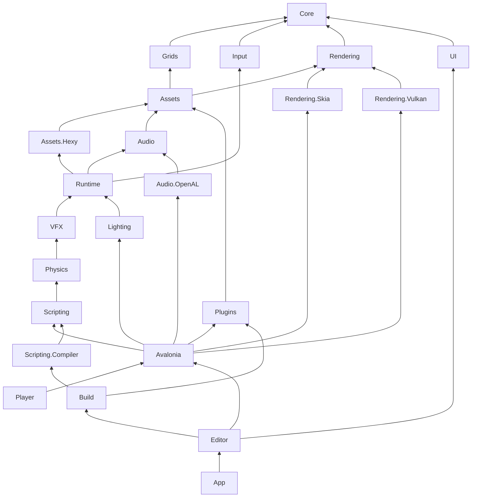

The repository is one solution, `Talesmith.slnx`, with the engine and editor libraries under `src`, sample games under `samples`, one test project per library under `tests`, and the benchmark and tool projects beside them. This page lists every project, shows how they depend on each other, and gives the rules that keep games free of editor code and contracts free of backends.

## Top-level folders

| Folder | Contents |
| --- | --- |
| `src/` | The engine, the host, the player, the editor and its toolkit. |
| `samples/` | Lantern Grove, Isle Hopper and Hex Quest: game folders plus the projects that build their plugins and scripts into them. |
| `tests/` | xUnit v3 test projects, one per library, plus the samples' tests and `Talesmith.EndToEnd.Tests`. |
| `benchmarks/` | `Talesmith.Benchmarks`: BenchmarkDotNet micro-benchmarks and the scale scenes. |
| `tools/` | `Talesmith.Screenshots`, `Talesmith.ShaderCompiler` and the editor smoke test script. |
| `packaging/` | What turns a published editor into release packages: the Linux launcher and Debian package, the Windows installer and the Nix package. See [Releases](./continuous-integration.mdx#releases). |
| `website/` | This documentation site. |

`flake.nix` makes the repository a Nix flake that installs the latest release. Shared build settings are in `Directory.Build.props`, package versions in `Directory.Packages.props`, and `global.json` pins the .NET SDK and selects the Microsoft Testing Platform runner. See [Building and testing](./building.mdx).

## Engine projects

| Project | Purpose |
| --- | --- |
| `Talesmith.Core` | ECS, systems, events, time, math, images, the profiler and plugin contracts |
| `Talesmith.Grids` | Hexagonal and square grid layouts, chunk addressing and pathfinding |
| `Talesmith.Input` | Keyboard and mouse state, actions, bindings and input profiles |
| `Talesmith.Rendering` | Cameras, render frames, batching, materials, shaders, light maps and the renderer contract |
| `Talesmith.Assets` | Asset loading and caching, guids and `.meta` files, the asset database, textures and the tile map model with its editing tools |
| `Talesmith.Assets.Hexy` | Reading and writing `.hexy` maps |
| `Talesmith.Audio` | Audio contracts, WAV and Ogg Vorbis decoding and a silent device |
| `Talesmith.Plugins` | Plugin discovery, isolation, ordering, registration and the plugin manager |
| `Talesmith.Runtime` | The game loop, scenes and scene documents, prefabs, built-in components and systems, maps, scheduling, tweens and headless benchmarking |
| `Talesmith.Physics` | Colliders, rigid bodies, characters, tile map collision, queries and contact events |
| `Talesmith.VFX` | Particle emitters, modules, presets and their rendering |
| `Talesmith.Lighting` | 2D lights, shadow casters, emissive sprites and the lighting environment |
| `Talesmith.Scripting` | The script API, script components, their lifecycle and loading compiled scripts |
| `Talesmith.Rendering.Skia` | The Skia backend |
| `Talesmith.Rendering.Vulkan` | The Vulkan backend, with its GLSL shaders and their compiled SPIR-V in `Shaders/` |
| `Talesmith.Audio.OpenAL` | The OpenAL Soft audio backend |
| `Talesmith.Avalonia` | The Avalonia host: game sessions, the game view, presenters, overlays, developer tools and desktop startup |
| `Talesmith.Player` | The `talesmith-player` executable: runs or benchmarks a game folder, and is the executable of exported games |

## Editor projects

| Project | Purpose |
| --- | --- |
| `Talesmith.Scripting.Compiler` | Compiling scripts with Roslyn, diagnostics, hot reload and IDE projects |
| `Talesmith.Build` | Exporting games: checking, collecting and packing content, publishing the player and the build report |
| `Talesmith.UI` | The editor's Avalonia toolkit: themes, icons, docking, dialogs and editor controls |
| `Talesmith.Editor` | The editor: hub, workspace, viewport and tools, inspector, assets, tile mapping, particles, lighting, play mode, scripts, plugins and builds |
| `Talesmith.App` | The `talesmith` editor executable |

## Samples, tests and tools

| Project | Purpose |
| --- | --- |
| `samples/LanternGrove`, `Talesmith.Samples.LanternGrove` | Lantern Grove's game folder; the project compiles its scripts into `assets/scripts/bin` |
| `samples/IsleHopper`, `Talesmith.Samples.IsleHopper` | Isle Hopper's game folder and gameplay plugin |
| `samples/HexQuest`, `Talesmith.Samples.HexQuest`, `Talesmith.Samples.Cutscenes` | Hex Quest's game folder, its gameplay plugin and the cutscene plugin |
| `samples/Shared` | The pause menu Isle Hopper and Hex Quest compile in |
| `samples/Plugin.targets` | Builds a sample plugin and copies it into its game's `assets/plugins` folder |
| `tests/Talesmith.*.Tests` | One test project per library |
| `tests/Talesmith.EndToEnd.Tests` | Templates, Lantern Grove with simulated keys, plugins switched off and on, and a Linux export |
| `benchmarks/Talesmith.Benchmarks` | Micro-benchmarks and the scale scenes for the player's benchmark |
| `tools/Talesmith.Screenshots` | Renders the editor headlessly for this site, exports the shortcut list and runs the editor stress benchmark |
| `tools/Talesmith.ShaderCompiler` | Compiles the Vulkan backend's GLSL shaders to SPIR-V |
| `tools/smoke/editor-smoke.sh` | Drives the editor in a real X11 window under Xvfb |

The [Tools](./tools.mdx) page covers the benchmark and tool projects.

## Dependencies

Arrows point from a project to the projects it references. Indirect references are left out: `Runtime` also references `Core`, `Grids`, `Assets` and `Rendering` directly, for example. `Physics` references `VFX` so particles can collide with colliders through VFX's `IParticleCollisionProvider`, and `Scripting` references `Physics` so scripts get collision callbacks.

## Rules

- **Games never reference the editor.** No project under `Talesmith.Avalonia` references `Talesmith.Editor`, `Talesmith.UI`, `Talesmith.Build` or `Talesmith.Scripting.Compiler`, and nothing under `Talesmith.Avalonia` uses Avalonia controls other than the host's. Shipped games contain no Roslyn.
- **Contracts never reference a backend.** Plugins compile against `Core`, `Grids`, `Input`, `Assets`, `Rendering`, `Audio`, `Runtime` and the engine modules. Skia, Vulkan and OpenAL are chosen by the host when a game starts, and a plugin that uses them directly needs the `renderBackend` permission.
- **Modules register themselves** through `IServiceCollection` extension methods (`AddTalesmithPhysics`, `AddTalesmithParticles`, `AddTalesmithLighting`, `AddTalesmithScripting`). `GameSession.Create` calls them, so the player, the editor viewport and play mode get the same engine.
- **Authored content is data.** Scenes, prefabs, particle presets and import settings are JSON documents that refer to assets by guid; see [File formats](./file-formats/index.mdx).
- **Plugin editor parts are separate assemblies.** A plugin's runtime assembly must not reference editor assemblies; its editor code goes in the assembly named by `editorAssembly`.

## Where new code goes

| You are adding | Put it in |
| --- | --- |
| A component or system every game can use | The engine module it belongs to (`Physics`, `VFX`, `Lighting`), or `Runtime` for general gameplay, registered from that module's `AddTalesmith…` method |
| A new asset type and its importer | `Talesmith.Assets` for formats without engine dependencies, otherwise the module that uses it; register an `IAssetImporter` and an asset kind |
| Something only the host or the window needs | `Talesmith.Avalonia` |
| An editor panel, tool or inspector | A feature folder in `Talesmith.Editor`, registered in `EditorServiceCollectionExtensions` |
| A reusable control or style | `Talesmith.UI` |
| Game-specific code | A plugin or scripts in the game's project, never the engine |
| Tests | The test project of the library you changed; cross-project flows go in `Talesmith.EndToEnd.Tests` |

## Related

- [Runtime architecture](./architecture.mdx)
- [Editor architecture](./editor-architecture.mdx)
- [Building and testing](./building.mdx)
