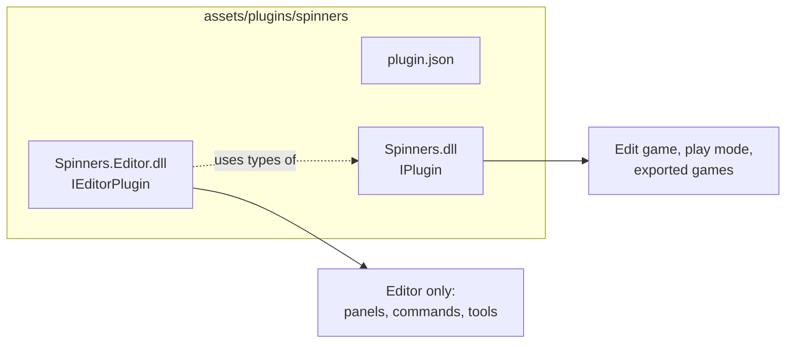

A plugin is a .NET class library that the engine loads into its own load context when a game starts. It registers what it adds (systems, components, scenes, asset importers, overlays, services) and can carry a second assembly that extends the editor with panels, commands, tools and inspectors. This section shows how to write, package, test and ship plugins, from a first plugin to editor extensions.

<Screenshot
  name="plugins/plugins-panel"
  caption="The Plugins panel in the Hex Quest sample, with its gameplay and cutscene plugins."
  priority
/>

## What a plugin is

Every plugin is a folder in the game's `assets/plugins` folder with three kinds of files:

- `plugin.json`, the [manifest](./package/manifest.mdx): the plugin's id, name, version, the assemblies to load, the engine it was built for, its dependencies and the permissions it needs.
- The runtime assembly, such as `Spinners.dll`, with exactly one public class that implements `IPlugin`. Games load it.
- Optionally an editor assembly, such as `Spinners.Editor.dll`, with `IEditorPlugin` classes. Only the editor loads it.

`IPlugin` has one method. The engine calls it every time it builds a game, before the game's services exist, so a plugin only registers things:

```csharp title="SpinnersPlugin.cs"
public sealed class SpinnersPlugin : IPlugin
{
    public void Configure(IPluginBuilder builder)
    {
        builder.Services.AddComponent<Spinner>();
        builder.Services.AddSystem<SpinSystem>();
    }
}
```

`builder.Services` is the game's dependency injection container, `builder.Plugin` describes the plugin itself (id, version, folder, permissions) and `builder.Settings` holds its [settings](./package/settings.mdx).

## Plugins or scripts

Scripts and plugins are both C#, and scripts can define ECS components and systems too. Choose by what you need:

| | Scripts | Plugins |
| --- | --- | --- |
| Where the code lives | `assets/scripts`, part of one game | A class library you build with `dotnet build`, installed into any number of games |
| Who compiles it | The editor, every time you save | You, with the .NET SDK or an IDE |
| Reloading | Hot reload while the game runs | Rebuild, then reload the project |
| Attaches to entities | Yes, through a script component | Through components the plugin registers |
| Editor extensions | No | Panels, commands, viewport tools, gizmos, inspectors, asset handlers |
| Asset importers, overlays, render and engine services | No | Yes |
| NuGet packages | No | Yes, each plugin with its own versions |
| Settings per project, dependencies on other plugins, permissions | No | Yes |

Scripts compile against the installed plugins, so a script can use a plugin's components and services. A common split is engine features and tools in plugins, level-specific behavior in scripts. See [Your first script](/scripting/scripts/first-script) for scripts.

## Runtime and editor parts

The runtime assembly runs in every game: the edit game behind the scene viewport, play mode in the editor, and exported games. It must not reference editor assemblies, because exported games do not contain them.

The editor assembly runs only in the editor. It is loaded into the same load context as the runtime assembly, so it can use the runtime assembly's types, and its `IEditorPlugin` classes register editor features with the same calls the editor uses for its own panels and tools. See [Editor plugins](./editor/index.mdx).



## The samples

The repository's samples are built as plugins, and their code is the best place to see a pattern in use:

| Plugin | Folder | What it shows |
| --- | --- | --- |
| `samples.hexquest` | `samples/Talesmith.Samples.HexQuest` | Systems with hex pathfinding and camera zoom, a scene listener for music, a HUD overlay |
| `samples.cutscenes` | `samples/Talesmith.Samples.Cutscenes` | An asset importer, map triggers, async cutscene playback, dialogue input and an overlay. Walked through in [Example: the cutscene plugin](./cutscenes-example.mdx) |
| `samples.islehopper` | `samples/Talesmith.Samples.IsleHopper` | A platformer: fixed-step physics systems, scoped per-scene state, pickups, parallax, smooth motion |

Building the solution (`dotnet build Talesmith.slnx`) installs each sample plugin into its game's `assets/plugins` folder.

## In this section

<CardGrid columns={2}>
  <Card title="Your first plugin" icon="rocket" to="/plugins/first-plugin">
    From the New plugin button to a component and system running in the editor and in an exported game.
  </Card>
  <Card title="The plugin package" icon="package" to="/plugins/package/project-file">
    The project file, plugin.json, dependencies, permissions, settings and packaging.
  </Card>
  <Card title="Runtime extensions" icon="zap" to="/plugins/runtime/systems-and-components">
    Systems, components, scenes, services, importers, particle modules and overlays.
  </Card>
  <Card title="Editor extensions" icon="hammer" to="/plugins/editor">
    Panels, commands, viewport tools, gizmos, property editors and asset handlers.
  </Card>
  <Card title="Testing and debugging" icon="bug" to="/plugins/testing">
    Unit tests, headless games, debuggers and reloading.
  </Card>
  <Card title="Reference" icon="book" to="/plugins/reference/extension-points">
    Every extension point and every plugin.json field.
  </Card>
</CardGrid>
