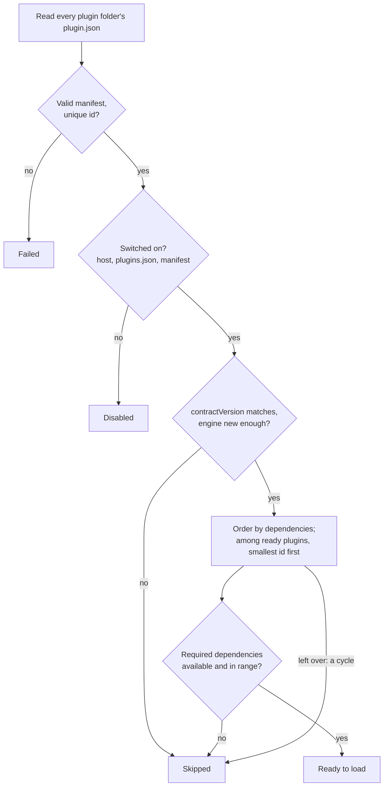
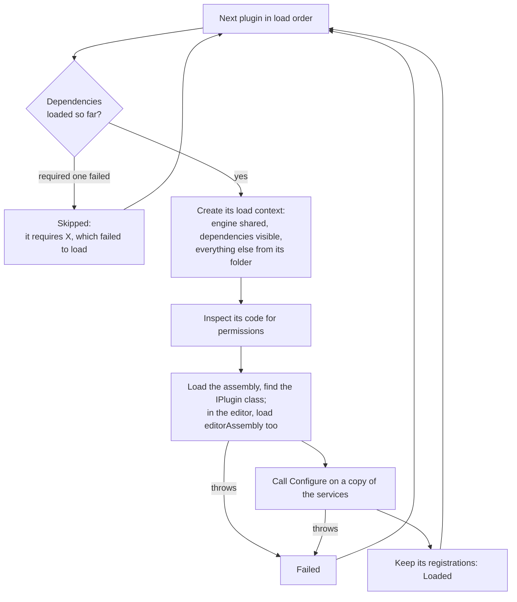

A plugin can build on other plugins: use their components and services, add to their systems, or extend their editor tools. This page covers declaring dependencies, the version range syntax, optional dependencies, how the engine orders plugins so dependencies come first, and what happens when a dependency is missing, switched off or the wrong version.

## Declare a dependency

List each plugin you use in `dependencies`, by id, with the versions you accept:

```json title="plugin.json"
{
  "id": "coral-cove.fairground",
  "assembly": "Fairground.dll",
  "contractVersion": 1,
  "dependencies": [
    { "id": "coral-cove.spinners", "version": "^1.2" },
    { "id": "acme.weather", "version": ">=2.0 <4.0", "optional": true }
  ]
}
```

| Property | Required | Default | Meaning |
| --- | --- | --- | --- |
| `id` | yes | | The dependency's plugin id. A plugin cannot depend on itself, and each id may be listed once. |
| `version` | no | any version | A [version range](#version-ranges) the installed version must satisfy. |
| `optional` | no | `false` | Whether the plugin also loads without the dependency. |
| `minimumVersion` | no | | The older form of `"version": ">=…"`. Use one or the other. |

Then reference the dependency's assembly from your project with `Private="false"`, so you compile against it without shipping a copy:

```xml
<Reference Include="/path/to/Coral Cove/assets/plugins/spinners/Spinners.dll" Private="false" />
```

At run time, a plugin sees the assemblies of the plugins it depends on, directly or through other dependencies, in their load contexts. Their types are the same types the dependency uses, so a `Spinner` component your plugin adds is the Spinners plugin's `Spinner`.

## Version ranges

Plugin versions are `major.minor.patch`; a fourth part is ignored and pre-release tags such as `1.0.0-beta` are not supported. Ranges are written like npm's:

| Range | Accepts | Does not accept |
| --- | --- | --- |
| `1.2.3` or `=1.2.3` | exactly 1.2.3 | 1.2.4 |
| `1.2`, `1.2.x`, `=1.2` | 1.2.0 up to, not including, 1.3.0 | 1.3.0 |
| `1`, `1.x` | 1.0.0 up to 2.0.0 | 2.0.0 |
| `>=1.2` | 1.2.0 and newer | 1.1.9 |
| `>1.2.3` | anything newer than 1.2.3 | 1.2.3 |
| `>1.2` | 1.3.0 and newer (all of 1.2 is excluded) | 1.2.5 |
| `<1.2` | anything older than 1.2.0 | 1.2.0 |
| `<=1.2` | up to and including all of 1.2 | 1.3.0 |
| `^1.2.3` | 1.2.3 up to 2.0.0 | 2.0.0, 1.2.2 |
| `^0.2.3` | 0.2.3 up to 0.3.0: for 0.x versions a minor release may break | 0.3.0 |
| `^0.0.3` | only 0.0.3 | 0.0.4 |
| `~1.2.3` | 1.2.3 up to 1.3.0: patch releases only | 1.3.0 |
| `~1` | 1.0.0 up to 2.0.0 | 2.0.0 |
| `>=1.2 <2.0` | every comparison must hold | 2.0.0 |
| `1.0 \|\| ^3.0` | either range: all of 1.0, or 3.0.0 up to 4.0.0 | 2.0.0 |
| `*`, `x`, or no `version` | any version | |

Spaces after an operator are allowed: `>= 1.2 < 2.0` is the same as `>=1.2 <2.0`. Hyphen ranges such as `1.0 - 2.0` are not supported; write `>=1.0 <=2.0`.

For most dependencies, `^` with the version you built against is right: it accepts every later release that keeps compatibility under semantic versioning.

An invalid range makes the manifest invalid, with a message that names the part it could not read:

```text
- dependencies[0] version: "-" in "1.0 - 2.0" is not a version or comparison; use forms such as "1.2.0", "^1.2", "~1.2", ">=1.2 <2.0" or "*".
```

## Optional dependencies

An optional dependency is used when it is installed, switched on, loads and matches the range. The plugin is then configured after it and sees its assemblies, as with a required dependency. When the dependency is missing, off, broken or out of range, the plugin loads without it and its card shows a warning such as **it optionally uses acme.weather >=2.0 &lt;4.0, which is not installed; it loads without it.**

Your code must then not touch the dependency's types, or .NET throws when it loads them. Keep everything that uses them in a separate class, and call it only when the dependency is there. One way to tell is a registration the dependency always makes:

```csharp title="FairgroundPlugin.cs"
using Microsoft.Extensions.DependencyInjection;
using Spinners;
using Talesmith.Authoring;
using Talesmith.Plugins;
using Talesmith.Systems;

namespace Fairground;

public sealed class FairgroundPlugin : IPlugin
{
    public void Configure(IPluginBuilder builder)
    {
        var hasSpinners = builder.Services.Any(d => d.ImplementationInstance is ComponentRegistration { Type.FullName: "Spinners.Spinner" });
        if (hasSpinners)
            SpinnerSupport.Register(builder.Services);
    }
}

internal static class SpinnerSupport
{
    public static void Register(IServiceCollection services) => services.AddSystem<CarouselSystem>();
}

internal sealed class CarouselSystem : ISystem
{
    public void Update(in SystemContext context)
    {
        foreach (var archetype in context.World.Query<Spinner>())
        {
            foreach (ref var spinner in archetype.GetSpan<Spinner>())
                spinner.Speed = Math.Min(spinner.Speed + 1, 360);
        }
    }
}
```

This works because a dependency that is present is configured first, so its registrations are already in `builder.Services`.

## Load order

The engine decides the order before it loads any code, from the manifests alone:



1. Plugins sharing an id fail, every copy of them.
2. Switched-off plugins are disabled, and plugins built for another contract version or a newer engine are skipped.
3. The rest are sorted so every plugin comes after the plugins it depends on, required or optional. Whenever several plugins are ready, the one with the smallest id (in ordinal order) goes first, so the order depends only on the installed plugins, never on folder names or the file system.
4. As each plugin's turn comes, its dependencies are checked. A required dependency that is missing, off, skipped, failed or out of range skips the plugin, and in turn every plugin that requires it.
5. Plugins left over because they depend on each other are skipped with **its dependencies form a cycle: a -> b -> a.**, and plugins that depend on a cycle with **it depends on a, whose dependencies form a cycle.**

Then the engine loads and configures the plugins in that order:



`Configure` works on a copy of the game's services. When it throws, the copy is thrown away, so a failing plugin leaves no half-finished registrations behind, and the game starts without it. Plugins configured later override earlier registrations the usual way: for services resolved one at a time, the last registration wins, so a plugin can replace a service of a plugin it depends on.

The final order is the order of `PluginLoadReport.Loaded`, and the order in which the Hex Quest game lists `samples.cutscenes` before `samples.hexquest` (neither depends on the other, so the smaller id goes first).

## When a dependency is not there

| Situation | Required dependency | Optional dependency |
| --- | --- | --- |
| Not installed | Skipped: **it requires coral-cove.spinners ^1.2, which is not installed.** | Loads, with a warning |
| Installed, version out of range | Skipped: **it requires coral-cove.spinners ^1.2, but version 1.1.0 is installed.** | Loads, with a warning |
| Switched off | Skipped: **it requires coral-cove.spinners, which is disabled.** | Loads, with a warning |
| Skipped or failed | Skipped: **…which is skipped.** or **…which failed to load.** | Loads, with a warning |
| Installed twice | Skipped: **…which is installed more than once.** | Loads, with a warning |

The **Dependencies** list under **Details** on the plugin's card shows each dependency with a check mark or a red mark and its status: **1.2.0 installed**, **1.1.0 installed, out of range**, **1.2.0 switched off**, **1.2.0 did not load** or **Not installed**.

## Related

- [The manifest](./manifest.mdx)
- [Installing and managing plugins](../installing.mdx)
- [plugin.json reference](../reference/plugin-json.mdx)
