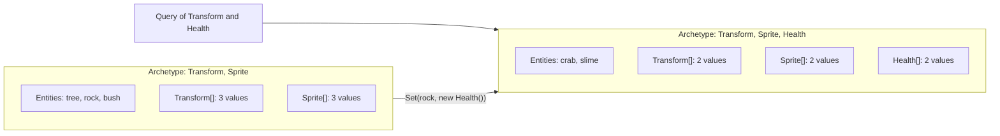

Under the editor, every scene is an ECS world. An entity is only an id, components are plain data attached to it, and systems are the code that runs over many entities at once. This page explains how the world stores that data, how you read and change it from scripts and systems, and how to declare components of your own.

## Entities, components and the world

A `World` owns the entities of one scene. Each scene gets its own world, created in the scene's service scope, so nothing carries over from one scene to the next.

| Concept | What it is in code |
| --- | --- |
| Entity | `Entity`, a record struct of an `Id` and a `Version`. It holds no data. When an entity is destroyed its id is reused with a higher version, so an old handle never points at the new entity. `Entity.Null` never refers to anything. |
| Component | Any struct (or class) stored on an entity: `Transform`, `Sprite`, `Collider2D`, your own `Health`. An entity has at most one component of each type. |
| World | The container: `Create`, `Destroy`, `Set`, `Get`, `Has`, `Remove`, `IsAlive` and `Query`. A world is not thread-safe; it belongs to the game thread. |
| Archetype | The set of component types an entity has. All entities with exactly the same set share one archetype. |

A script reaches its scene's world through `World`, and its own entity through `Entity`. The entity you select in the hierarchy is the same kind of id; its name is a `Name` component and its place in the tree is a `Parent` component.

## How the world stores components

Entities with the same component types are stored together. Each archetype is a table: one row per entity and one contiguous array per component type. Adding or removing a component moves the entity's row to another table.



This layout is why the ECS is fast for many similar entities. A query visits only the archetypes that match, and within one archetype it walks arrays in order, so the CPU reads memory sequentially and nothing is looked up per entity. It is also why changing the *shape* of an entity costs more than changing a value: moving a row copies every component of that entity.

## Reading and changing components

`World.Get<T>(entity)` and a script's `GetComponent<T>()` return a **reference** into the archetype's array. Change fields through a `ref` local and the stored component changes. Assign the result to a plain `var` and you get a copy, and changes to the copy are lost.

```csharp
ref var health = ref GetComponent<Health>();
health.Current -= 1;              // changes the stored component

var copy = GetComponent<Health>();
copy.Current = 0;                 // changes only the local copy
```

| Call | Use it for |
| --- | --- |
| `World.Get<T>(entity)` | A reference to an existing component; throws when the entity has none |
| `World.TryGet<T>(entity, out var value)` | A copy, when the component may be missing |
| `World.TryGetRef<T>(entity, out var exists)` | A reference that may be null; check `exists` first |
| `World.Has<T>(entity)` | Whether the entity has the component |
| `World.Set(entity, value)` | Adds the component, or replaces it |
| `World.Remove<T>(entity)` | Removes the component; returns false when there was none |
| `World.Create(c1, c2, …)` | A new entity with up to four components, placed straight into its final archetype |
| `World.Destroy(entity)`, `world.DestroyWithChildren(entity)` | Removes an entity, or an entity and all its descendants |

Do not keep a `ref` across a structural change. Adding or removing any component of that entity moves its row, and the reference then points at stale memory. Take the reference again after `Set` or `Remove`.

### Struct and class components

Most components are structs, so they live inline in the archetype's arrays. A few are classes: `ParticleEmitter`, `TileMapComponent`, `MapObjectComponent`, `TriggerArea` and `ScriptComponent`. For those the array holds a reference to the object, so `GetComponent<ParticleEmitter>().Emit(20)` calls a method on the shared object and any copy of the reference sees the same emitter. Use a class only for data that is large, shared or has its own behavior. Every entity needs its own instance; never put the same class instance on two entities.

## Queries

`World.Query<T1, …, T4>()` returns a `Query` for entities that have all of those components. Queries are cached by their description and pick up new archetypes automatically, so calling `Query<Transform, Health>()` every frame costs a dictionary lookup, not a scan. For "with this but without that", build a `QueryDescription`:

```csharp
var alive = World.Query(QueryDescription.With<Health>().Without<Inactive>());
var drawn = QueryDescription.With<Transform>().WithAny<Sprite>().WithAny<ParticleEmitter>();
```

There are three ways to walk a query, from most convenient to fastest:

| Method | How it works | When to use it |
| --- | --- | --- |
| `query.ForEach((Entity e, ref Transform t, ref Health h) => …)` | Calls a delegate per entity with references to its components | Short loops where clarity matters more than speed |
| `foreach (var archetype in query)` with `archetype.GetSpan<T>()` | You loop over the spans of each archetype yourself | Most systems; no delegate call per entity and no allocation |
| `query.Run<TJob, T1, …>(ref job)` with a struct implementing `IForEach<…>` | The JIT inlines the job's `Execute` into the loop | Hot loops over thousands of entities |

A lambda that captures variables allocates a closure each time it is created, which is why systems that run every frame prefer spans or struct jobs. See [Systems](./systems.mdx) for each form in a complete system.

`query.Count`, `query.IsEmpty` and `query.TryGetSingle(out var entity)` answer the common questions without a loop. `TryGetSingle` is how systems find "the player" or "the camera" when there is exactly one.

## Structural changes and the command buffer

Creating or destroying entities and adding or removing components are structural changes. They are not allowed while a query is iterating, because they would move rows inside the arrays being walked. `World.IsIterating` tells you whether a query is running.

Inside a system, record changes in `context.Commands`, a `CommandBuffer`. It plays back right after your system returns. Entities created through it are reserved at once, so you can store the handle and give it components in the same frame:

```csharp title="assets/scripts/Health.cs"
namespace MyGame;

/// <summary>Hit points of anything that can be hurt.</summary>
[Component(Category = "Gameplay", Icon = "heart")]
public struct Health
{
    [Range(0, 100)]
    public int Current;

    [Range(1, 100)]
    public int Maximum;

    [Tooltip("Hit points regained per second.")]
    public float Regeneration;

    [Transient]
    public float Pending;
}

/// <summary>Regenerates health and removes entities whose health ran out.</summary>
[UpdateIn(SystemPhase.Update)]
public sealed class HealthSystem : ISystem
{
    public void Update(in SystemContext context)
    {
        var delta = context.Time.DeltaTime;
        foreach (var archetype in context.World.Query<Health>())
        {
            var healths = archetype.GetSpan<Health>();
            var entities = archetype.Entities;
            for (var i = 0; i < healths.Length; i++)
            {
                ref var health = ref healths[i];
                health.Pending += health.Regeneration * delta;
                if (health.Pending >= 1)
                {
                    health.Current = Math.Min(health.Maximum, health.Current + 1);
                    health.Pending -= 1;
                }

                if (health.Current <= 0)
                    context.Commands.Destroy(entities[i]);
            }
        }
    }
}
```

Scripts usually do not need the buffer. Script updates run outside any query, so `AddComponent`, `RemoveComponent`, `CreateEntity` and `Destroy` apply immediately. The exception is `Destroy`: called while a query iterates, for example from a `ForEach` callback in a script, it waits until the start of the next script update phase.

## Declaring your own components

A component is a struct with public fields. Mark it `[Component]` so scenes, prefabs and the inspector know it, as `Health` above does. Its fields follow the same rules and attributes as script fields: public fields and settable properties are saved, `[SerializeField]` saves a private field, `[Transient]` keeps runtime state out of the file, and `[Range]`, `[Tooltip]`, `[Header]` and the rest shape the inspector. See [Fields and the inspector](../scripts/fields.mdx) for the full list.

| Where you declare it | How it is registered |
| --- | --- |
| A script file in `assets/scripts` | Automatically, when the game starts: every `[Component]` type in the scripts is registered |
| A plugin | `services.AddComponent<Health>()` in the plugin's `Configure` |

Scenes save a component under its full type name, such as `MyGame.Health`. The ECS keeps component types for the life of the process, and that has costs for components declared in scripts: any script change then needs play mode to restart instead of hot reloading, and an assembly that declares components is never unloaded. In the editor, the scene view rebuilds its game in the background after such a change, so script components appear under **Add component** and in the inspector like any other. See [Compiling and hot reload](../scripts/hot-reload.mdx).

## Scripts, components or systems

All three end up in the same world, so the choice is about how the code is organized and how many entities it runs for.

| Use | When | Example |
| --- | --- | --- |
| A script | Behavior of one entity or a handful: it has state, reacts to its own collisions, runs a sequence of waits | A player controller, a door, a boss, the shrine in Lantern Grove |
| A component and a system | The same logic over many entities, or data that other systems read | Health regeneration for every enemy, parallax layers, bullets |
| A plugin | Code shared between games, editor tools, game UI in Avalonia, code scenes, services | A cutscene system, a HUD overlay, an inventory service |

Scripts are dispatched per type from flat lists without allocating, but each one is still a separate object and a method call per frame. For thousands of similar entities, a system over a component wins: one call per frame instead of one per entity, and data laid out for the CPU cache. Many games mix them. Lantern Grove has scripts for the player, the lanterns and the shrine, and a `Parallax` component with a `ParallaxSystem` for its backdrop layers, all in its `assets/scripts` folder.

## Related

- [Systems](./systems.mdx)
- [Working with components](../scripts/components.mdx)
- [Built-in components](/guide/scenes/components)
- [Systems and components in plugins](/plugins/runtime/systems-and-components)
- [Engine architecture](/developers/architecture)
