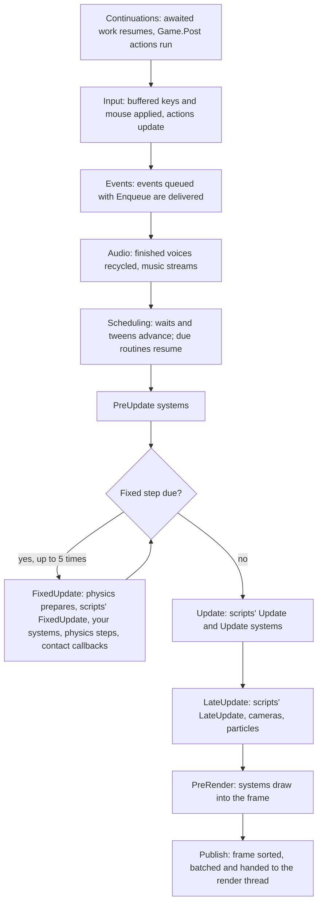

A Talesmith game runs on its own game thread, separate from the window's UI thread and from the thread that renders. Every frame follows the same fixed sequence of steps, and all game code, scripts, systems and `await` continuations, runs on the game thread inside it. This page walks through one frame, explains fixed and variable steps, and shows how game code and UI code exchange data without locks.

## One frame

`Game.Tick` runs one frame. Each box below is a profiler marker, so the performance overlay shows exactly where a frame's time goes.



| Step | What happens | Matters to you because |
| --- | --- | --- |
| Continuations | Work awaited by game code resumes, and actions other threads sent with `Game.Post` run | UI buttons that change the game run here, before input |
| Input | Keyboard and mouse events buffered since the last frame are applied | Every system sees the same input for the whole frame |
| Events | Events queued with `Enqueue`, from any thread, are delivered | Queued events arrive at the start of the next frame |
| Audio | Finished voices are recycled; music fades advance | |
| Scheduling | `Wait`, `NextFrame`, `WaitUntil`, `Every` and tweens advance | A routine resumes here, before any update of the frame |
| `PreUpdate` | Systems that prepare the frame | |
| `FixedUpdate` | Zero or more fixed steps | Physics and anything that must not depend on the frame rate |
| `Update`, `LateUpdate` | Gameplay, then what follows it | Scripts' `Update` and `LateUpdate` run here |
| `PreRender` | Systems draw into `RenderContext.Frame` | Only place to draw |
| Publish | The frame goes to the render thread | The game never waits for drawing |

New scripts are created at the start of the next update phase after they are added, and a script's `OnStart` runs just before its first `FixedUpdate` or `Update`. The [script lifecycle](../scripts/lifecycle.mdx) has the details per method.

## Fixed steps and variable steps

The game runs two clocks:

- **Variable step.** `Update` and `LateUpdate` run once per frame. `DeltaTime` is the real time since the last frame, scaled by `TimeScale`. At 144 Hz it is about 7 ms; at 30 Hz about 33 ms.
- **Fixed step.** Time is added to an accumulator each frame, and `FixedUpdate` runs once for every whole step in it, 60 per second by default. Each step sees the same `DeltaTime`. A 144 Hz frame often runs no fixed step; a 30 Hz frame runs two.

Physics steps only in the fixed update, so gravity, collisions and character movement behave the same at every frame rate, and a replay with the same input gives the same result. Put movement and forces in `FixedUpdate`. Read input in `Update` and remember it (as Lantern Grove's player does with its jump buffer), because a button pressed this frame is only "pressed" during this frame, and a frame may run no fixed step at all.

Rendering at a higher rate than the fixed step can make fixed-step motion look uneven: an object moves in some frames and not in others. Rigid bodies and character controllers with interpolation turned on are drawn between their last two fixed-step positions; `GameTime.Interpolation` gives systems the same fraction.

Two limits protect the game from long frames:

- A frame never counts as longer than 0.25 seconds, so a debugger break or a stall does not fast-forward the game.
- At most `maxFixedStepsPerFrame` fixed steps run in one frame (5 by default). Time beyond that is dropped, so a frame that is slow because of physics cannot cause an ever-growing backlog. The game slows down instead of spiralling.

### Time scale and pausing

`TimeScale` multiplies game time, and `IsPaused` stops it. Both act on the next frame. While paused, `FixedUpdate` does not run and `Update` and `LateUpdate` still run with a `DeltaTime` of 0, so input, menus, camera effects on unscaled time and `WaitRealtime` keep working. `UnscaledDeltaTime` and `UnscaledTotalTime` ignore both. Setting `pauseWhenInactive` in `game.json` stops game time while the window is in the background. See [Time](../scripts/time.mdx).

## Frame rate settings

`config/game.json` sets the defaults; every setting is optional.

| Setting | Default | |
| --- | --- | --- |
| `fixedUpdateRate` | 60 | Fixed steps per second |
| `maxFixedStepsPerFrame` | 5 | Fixed steps one frame may run before time is dropped |
| `vSync` | true | One frame per display refresh |
| `maxFramesPerSecond` | 0 | A frame-rate limit; 0 for none |
| `pauseWhenInactive` | false | Stop game time while the window is in the background |

`FramePacing` changes the frame rate while the game runs, for example from a settings menu. With VSync on, frames follow the display and a limit below the refresh rate skips refreshes. With VSync off, frames run on their own schedule up to the limit. Either way the window shows the newest frame at the display's refresh rate.

To end the game, call `GameLifetime.Quit()`. The window closes and the game shuts down; in the editor, play mode stops. Both services are in `Talesmith.Runtime.Hosting`:

```csharp title="assets/scripts/GameKeys.cs"
using Talesmith.Runtime.Hosting;

namespace MyGame;

/// <summary>Quits the game on Escape and caps the frame rate on F2.</summary>
public sealed class GameKeys : Script
{
    private FramePacing? _pacing;
    private GameLifetime? _lifetime;

    protected override void OnStart()
    {
        _pacing = GetService<FramePacing>();
        _lifetime = GetService<GameLifetime>();
    }

    protected override void Update()
    {
        if (Input.WasPressed(Key.Escape))
            _lifetime!.Quit();
        if (Input.WasPressed(Key.F2))
        {
            _pacing!.VSync = false;
            _pacing.MaxFramesPerSecond = _pacing.MaxFramesPerSecond == 0 ? 30 : 0;
        }
    }
}
```

The editor's play mode does not react to `Quit`, so test a quit button in an exported game or the player. Headless runs stop measuring when it is called.

## Threads

| Thread | Runs | Owns |
| --- | --- | --- |
| Game thread | `Game.Tick`: every frame, every system, every script, every `await` continuation in game code | The world, systems, scenes and most services |
| UI thread | Avalonia: the window, overlays, the editor | Avalonia controls |
| Render thread | Drawing published frames. With Skia it is Avalonia's render thread; with Vulkan a dedicated thread | The frame being drawn |
| Thread pool | Background work such as asset decoding and music streaming | Nothing of the game's |

In the player and in the editor's play mode, the game thread is a dedicated simulation thread of above-normal priority. With VSync it runs a frame on every refresh the window reports. The UI thread never waits for the game, and the game never waits for the UI thread. If the UI thread is busy, with a layout spike, a slow dialog or the editor rebuilding a panel, refresh reports pause and the game thread keeps running frames on its own clock at the display's refresh rate. That is why play mode in the editor keeps the same timing however busy the editor is: editing and playing do not share a thread.

The renderer and the game do not share data either. The game builds each frame into a `RenderFrame`, a list of draws, and hands it over through three rotating buffers: one being built, one ready, one being drawn. Neither side waits. When the game produces frames faster than they can be drawn, the newest wins. The render thread reads nothing but that frame, so it never sees half-updated state.

`await` in game code always resumes on the game thread, at the start of a frame, even when the awaited work completed on the thread pool. You can load an asset with `LoadAsync` and touch the world right after the `await`.

## Crossing threads

Game code runs on the game thread and UI code on the UI thread, and neither touches the other's objects. They exchange data through these:

| From | API | Behavior |
| --- | --- | --- |
| Any thread to the game | `Game.Post(action)` | Runs at the start of the next frame, in order with other posts; exceptions are logged |
| Any thread to the game | `await Game.InvokeAsync(func)` | Runs on the game thread and returns the result; immediately when already on it |
| Any thread | `IEventBus.Enqueue(e)` | Delivered at the start of the next frame on the game thread |
| The game to the UI | `IGameUi.Post(action)` | Runs on the UI thread; without a UI, as in tests, runs immediately |
| The game to the UI | `ViewState<T>.Publish(snapshot)` | The UI's `Changed` handler receives the newest snapshot, at most once per UI update |

`ViewState<T>` is the usual pattern for HUDs. The game publishes immutable records, as often as every frame; publishing a value equal to the current one does nothing, and however many values are published between two UI updates, the UI is told once, with the newest. The UI reads `Value` or handles `Changed`; it never reaches into the world.

```csharp
public sealed record ScoreView(int Score, int Lives);

public sealed class ScoreHud(IGameUi ui)
{
    public ViewState<ScoreView> View { get; } = new(ui, new ScoreView(0, 3));

    public void Show(int score, int lives) => View.Publish(new ScoreView(score, lives));
}
```

In the other direction, a button in an overlay posts a command to the game:

```csharp
pause.Click += (_, _) => game.Post(() => game.IsPaused = !game.IsPaused);
```

`Game.IsGameThread` tells whether code runs on the game thread, and `Game.VerifyAccess()` throws when it does not. A complete overlay is in [Game UI](./game-ui.mdx).

## Performance tips

- **Know which clock you are on.** Work in `FixedUpdate` runs up to five times in a slow frame, which makes a slow frame slower. Keep fixed-step code to simulation.
- **Spread expensive work.** A pathfinding search or a level generator that takes 30 ms causes a visible hitch. Split it across frames with `await NextFrame()` in a routine, or run pure computation on the thread pool with `Task.Run` and apply the result after the `await`, which resumes on the game thread.
- **Never block the game thread.** `Thread.Sleep`, `Task.Wait`, `.Result` and file access in an update method freeze the game; the analyzers warn about them. Await instead.
- **Read the counters.** The performance overlay shows each step of the frame, the number of fixed steps per frame and the time spent in scripts (`Script time`), systems (`Systems/{type}`), physics, particles and lighting. A frame where `FixedUpdate` runs several steps every time is a frame that cannot keep up with the fixed rate.

## Related

- [Systems](./systems.mdx)
- [Time](../scripts/time.mdx)
- [Waiting, routines and tweens](../scripts/waiting.mdx)
- [Game UI](./game-ui.mdx)
- [Engine architecture](/developers/architecture)
