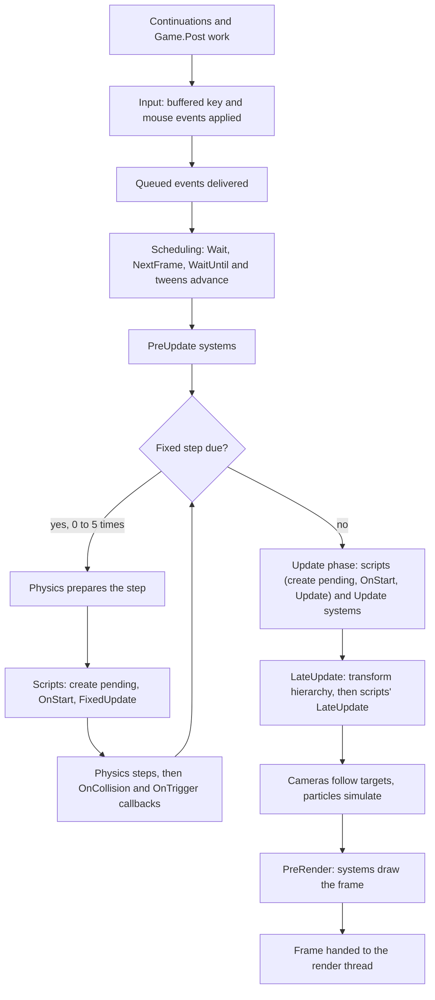

A script is a class that derives from `Script` and overrides the methods it needs. The engine calls them at fixed points: once when the script is created, every frame or fixed step while it runs, when contacts happen and when it goes away. This page lists every method, shows where they fall in a frame, and covers enabling and disabling, the order between scripts and what happens when a script throws.

## Lifecycle methods

| Method | When it runs |
| --- | --- |
| `OnCreate()` | Once, when the script is attached. Scripts saved in the scene are created when the scene starts; scripts added later are created at the start of the next update phase. Use it instead of a constructor. |
| `OnEnable()` | Whenever the script becomes enabled while its entity is active, starting right after `OnCreate`. |
| `OnSceneLoaded(scene)` | Once the scene has started, after every script in the scene ran `OnCreate` and `OnEnable`. Scripts added later never receive it. |
| `OnStart()` | Once, before the script's first `FixedUpdate` or `Update`. A script that starts disabled runs it when it is first enabled. |
| `FixedUpdate()` | Every fixed step, 60 per second by default, after physics prepares the step and before it steps. |
| `Update()` | Once per frame. |
| `LateUpdate()` | Once per frame after every `Update`, before cameras follow their targets. |
| `OnCollisionEnter`, `OnCollisionStay`, `OnCollisionExit` | When the entity's collider starts touching, keeps touching or stops touching another collider, from the physics step. |
| `OnTriggerEnter`, `OnTriggerStay`, `OnTriggerExit` | When the entity's collider overlaps a trigger, or another collider enters the entity's trigger. |
| `OnDisable()` | When the script is disabled, its entity becomes inactive, or before `OnDestroy`. |
| `OnSceneUnloaded(scene)` | When the scene starts unloading, before `OnDisable` and `OnDestroy`. |
| `OnDestroy()` | Once, when the script is removed, its entity is destroyed or the scene unloads. |

The base methods are empty, so you only override what you use. The engine also checks which update methods a script type overrides and only calls those: a script without `Update` costs nothing per frame.

`Script` has no `Awake`. `OnCreate` is the first method that can use the script API; the constructor runs before the script is attached to anything, and touching `Entity`, `World` or any service there throws. Scripts need a public parameterless constructor, which C# gives you when you write none.

To see the order for yourself, attach this script to an entity and press play. `Log.Debug` messages are hidden in the editor's console by default, so the per-frame calls do not flood it.

```csharp title="assets/scripts/LifecycleLogger.cs"
using Talesmith.Runtime.Scenes;

namespace MyGame;

/// <summary>Logs every lifecycle call, to see the order for yourself.</summary>
public sealed class LifecycleLogger : Script
{
    protected override void OnCreate() => Log.Info("OnCreate");

    protected override void OnEnable() => Log.Info("OnEnable");

    protected override void OnSceneLoaded(Scene scene) => Log.Info("OnSceneLoaded");

    protected override void OnStart() => Log.Info("OnStart");

    protected override void FixedUpdate() => Log.Debug("FixedUpdate");

    protected override void Update() => Log.Debug("Update");

    protected override void LateUpdate() => Log.Debug("LateUpdate");

    protected override void OnDisable() => Log.Info("OnDisable");

    protected override void OnSceneUnloaded(Scene scene) => Log.Info("OnSceneUnloaded");

    protected override void OnDestroy() => Log.Info("OnDestroy");
}
```

When the scene loads you see `OnCreate`, `OnEnable` and `OnSceneLoaded`; `OnStart` follows on the first frame. When you stop play mode, `OnSceneUnloaded`, `OnDisable` and `OnDestroy` run in that order.

## Where scripts run in a frame

Every frame runs the same steps on the game thread. Scripts run inside three of the engine's system phases, next to the built-in systems:



A few consequences worth knowing:

- **Awaited work resumes first.** A routine waiting on `Wait`, `NextFrame` or a tween continues near the start of the frame, before any `FixedUpdate` or `Update` of that frame. See [Waiting, routines and tweens](./waiting.mdx).
- **Input is the same all frame.** Keys pressed during a frame are applied at the start of the next one, so `Update` and `FixedUpdate` see identical input state within a frame.
- **Contacts arrive inside the fixed step.** Collision and trigger callbacks run right after the physics step, so every script's `FixedUpdate` for that step has already run. A frame with no fixed step has no contact callbacks.
- **`LateUpdate` sees final positions.** Child entities have their world `Transform` recomputed from their parent at the start of the LateUpdate phase, and cameras follow their targets after scripts' `LateUpdate`. That makes `LateUpdate` the place for camera rigs and anything that follows another entity.

[The game loop and threads](../concepts/game-loop.mdx) explains the frame, fixed steps and threads in detail.

### When new scripts start

A script added while the game runs, by `AddScript`, by spawning a prefab or by `Instantiate`, is created (`OnCreate`, `OnEnable`) at the start of the next update phase, whichever of `FixedUpdate`, `Update` or `LateUpdate` comes first. It then starts (`OnStart`) at the beginning of the next `FixedUpdate` or `Update` phase and receives updates from that phase on. A script added from `Update` is therefore created in that frame's `LateUpdate` phase and starts in the next frame. Fields you set right after adding or spawning, before the next phase, are already in place when `OnCreate` runs.

## Enabled, inactive and destroyed

Two switches decide whether a script runs:

- **`Enabled`** is the script's own switch, the checkbox in its inspector header. Setting it calls `OnEnable` or `OnDisable` immediately, in the middle of whatever code set it.
- **The `Inactive` component** switches a whole entity off: renderers skip it and every script on it is disabled. Adding `Inactive` calls `OnDisable` on the entity's scripts at once, and removing it calls `OnEnable`.

`IsActiveAndEnabled` is true only when both allow the script to run. A disabled script receives no updates and no collision or trigger callbacks, but it is not paused: its fields keep their values, and its event handlers, routines and tweens keep running until the script is destroyed. `IsDestroyed` becomes true once the script was removed, its entity destroyed or its scene unloaded.

Pair resources in `OnEnable` and `OnDisable` when they should only exist while the script runs. This gate listens for switch events only while enabled:

```csharp title="assets/scripts/Gate.cs"
namespace MyGame;

public readonly record struct SwitchToggled(string Channel, bool On);

/// <summary>Opens while a switch on its channel is on; listens only while enabled.</summary>
public sealed class Gate : Script
{
    public string Channel = "gate-a";

    private IDisposable? _subscription;

    protected override void OnEnable() => _subscription = Events.Subscribe((ref SwitchToggled e) =>
    {
        if (e.Channel == Channel)
            GetComponent<Collider2D>().IsTrigger = e.On;
    });

    protected override void OnDisable()
    {
        _subscription?.Dispose();
        _subscription = null;
    }
}
```

Things that should last as long as the script, such as most subscriptions and routines, need no cleanup: they end automatically when the script is destroyed.

## Collision and trigger callbacks

The six contact methods receive a `ContactInfo` seen from the script's entity:

| Member | Meaning |
| --- | --- |
| `Self` | The script's entity. |
| `Other` | The entity it touched. For a tile map it is the map's entity. |
| `Point` | A world point where the shapes touch. |
| `Normal` | Points from `Other` toward `Self`. A character standing on the ground gets a normal pointing up, `(0, -1)`. |
| `NormalImpulse` | How hard the bodies were pushed apart in the step; 0 for triggers. |
| `RelativeVelocity` | The velocity of `Other` relative to `Self`. |
| `IsTrigger` | Whether either collider is a trigger. |

The contact is passed with `in`, so overrides must declare it the same way. Because the normal points toward the script's own entity, checking where a hit came from is a sign test. On an enemy, a player landing on top pushes the enemy down, so the normal points down, along positive Y:

```csharp title="assets/scripts/Stompable.cs"
namespace MyGame;

/// <summary>Dies when the player lands on it from above and hurts the player otherwise.</summary>
public sealed class Stompable : Script
{
    protected override void OnCollisionEnter(in ContactInfo contact)
    {
        if (GetScript<PlayerHealth>(contact.Other) is not { } player)
            return;
        if (contact.Normal.Y > 0.7f)
            Destroy();
        else
            player.Hurt(1);
    }
}

public sealed class PlayerHealth : Script
{
    public int Lives = 3;

    public void Hurt(int amount) => Lives -= amount;
}
```

Stay callbacks run every fixed step while the contact lasts and either body is awake. Exit callbacks also run when a collider or entity is removed, so `Other` may no longer be alive; check `World.IsAlive(contact.Other)` before reading its components. See [Physics from scripts](./physics.mdx) for colliders, triggers and queries.

## Execution order between scripts

Within each phase, scripts run grouped by type:

1. By `[ScriptOrder(n)]` on the class, lower values first. Types without the attribute have order 0.
2. Types with the same order run in the order the game registered them.
3. Scripts of one type run in the order they were created.

Use `[ScriptOrder]` when one script must see another's work from the same frame. A script that turns input into decisions can run before everything else, and a follower can run after everything that moves its target:

```csharp
/// <summary>Reads input before any other script so they all see the same decision this frame.</summary>
[ScriptOrder(-100)]
public sealed class InputReader : Script
{
    public bool JumpQueued { get; private set; }

    protected override void Update() => JumpQueued = Input.WasPressed("Jump");
}

/// <summary>Follows the target after every other script has moved it.</summary>
[ScriptOrder(100)]
public sealed class Follower : Script
{
    public Entity Target;

    protected override void LateUpdate()
    {
        if (World.IsAlive(Target))
            Position = GetComponent<Transform>(Target).Position;
    }
}
```

Prefer splitting work across phases when you can, such as reading in `Update` and following in `LateUpdate`. Order numbers spread across many types are harder to reason about than phases.

## Scripts run only while playing

Scripts never run while the editor authors a scene. Moving the hero in the **Scene** panel does not call any of its scripts, and fields you change in the inspector are just saved values. Scripts run in play mode, in exported games and in headless runs of a game. If you need code that runs in the editor, such as a preview, write a [system](../concepts/systems.mdx) with an execution mode that includes editing, in a script file or a plugin.

## Exceptions

An exception that escapes a lifecycle method, an event handler, a tween callback or a routine started with `Run` is caught and logged with the script's type, the method and the entity's name, such as `MyGame.Mover.Update on Hero failed`. The rest of the frame carries on: other scripts, systems and rendering are unaffected, and the same script still receives its other callbacks.

A script that throws three times in a row is disabled, with a message saying so, and `OnDisable` runs. It stays off for the rest of the play session even if you set `Enabled` again; restarting play mode, or a hot reload that replaces the script with new code, gives it a fresh start. A successful call resets the count, so a script that fails now and then keeps running.

An exception inside an `async void` method cannot be traced back to its script, so it is logged without the script's name and does not count toward disabling it. Return `Task` instead and start the routine with `Run`. The compiler warns about `async void` with TS1004, see [Diagnostics and analyzers](./diagnostics.mdx).

## Related

- [Fields and the inspector](./fields.mdx)
- [Waiting, routines and tweens](./waiting.mdx)
- [Time](./time.mdx)
- [The game loop and threads](../concepts/game-loop.mdx)
